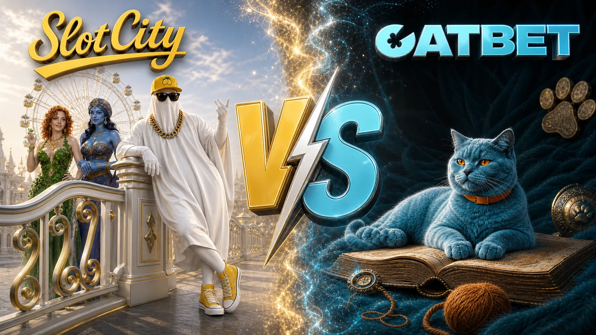

# Corporate Design & Landing Framework 3.0



> **Одна керована система для створення лендінгів, рекламних артів, product UI та компонентів —
> від бізнес-ідеї до перевіреного результату в корпоративному Git.**

Цей framework перетворює дизайн і delivery з набору разових домовленостей на відтворювану
корпоративну спроможність. Команда рухається швидше не через пропуск етапів, а тому що продуктова
правда, бренд, рішення, відповідальність і критерії готовності зафіксовані до початку дорогого
виробництва.

## Навіщо він бізнесу

| Цінність | Що змінюється |
|---|---|
| **Швидкість** | Кожен запит одразу потрапляє у правильний маршрут із готовими брифами, артефактами й next actions. |
| **Якість бренду** | Команди та AI працюють із доказовими токенами, компонентами, арт-напрямами й продуктовими обмеженнями. |
| **Контроль ризику** | Claims, legal, design, QA і release мають явних власників та людські approvals. |
| **Масштабування** | Один підхід працює для різних команд, підрядників, AI-агентів і форматів без втрати стандарту. |
| **Корпоративна пам'ять** | Рішення, джерела, асети й висновки залишаються у versioned knowledge base, а не зникають у чатах. |

Результат — не просто ще один лендінг або арт. Це повторно використовуваний актив: наступна команда
стартує з накопиченого знання, а не з чистого аркуша.

## Це не бібліотека документів

Framework працює як **операційна система delivery**:

- визначає тип задачі та обов'язковий маршрут;
- відділяє підтверджені факти від припущень і творчих рішень;
- не дозволяє AI вигадувати бренд, claims або approvals;
- фіксує гейти, власників, версії та критерії приймання;
- з'єднує дизайн, реалізацію, QA, Stage і Production в один контрольований ланцюг;
- повертає досвід кожного релізу назад у корпоративну базу знань.

## П'ять робочих маршрутів

| Track | Для чого |
|---|---|
| **Landing** | Повний шлях від intake і product truth до дизайну, реалізації, QA та релізу. |
| **Art** | Hero, promo card, background, 3D object, social або інший isolated visual. |
| **Product UI** | Екрани й сценарії цифрового продукту з опорою на brand evidence. |
| **Component** | Новий або змінений елемент дизайн-системи з контрольованими станами й поведінкою. |
| **Audit** | Перевірка існуючого дизайну на бренд, UX, консистентність і production readiness. |

Точку входу для будь-якого запиту визначає [Surface Router](framework/SURFACE-ROUTER.md).

## AI-ready, але human-controlled

Codex і Claude отримують не вільний промпт, а керований контекст: product truth, brand evidence,
дозволені джерела, stop conditions і точний очікуваний результат етапу. AI прискорює дослідження,
варіативність і production work; Product, Legal, Brand, Design, QA та Release зберігають право
рішення у своїх зонах відповідальності.

Brand Design Base містить дві незалежні дизайн-системи версії **0.9**: детально вилучений AI-ready
snapshot **SlotCity** та owner-supplied Brand Bible/Lore World **CATBET** з окремим шаром точних
токенів і компонентів. CATBET не успадковує токени чи компоненти SlotCity, а майбутній editable
source підключається через контрольований diff.

- [SlotCity Design Base](brand-archive/SLOTCITY/INDEX.md)
- [CATBET Brand Archive](brand-archive/CATBET/INDEX.md)
- [Brand Design Base contract](framework/BRAND-DESIGN-BASE.md)

## Як проходить робота

`Route → Intake → Product Truth → Brand Evidence → Content → Directions → Hero → Full Design → Assets → Implementation → QA → Release → Learn`

Кожен перехід залишає перевірюваний артефакт. Evidence-first підхід не обмежує креативність — він
дає їй надійну основу. Production починається після дизайн-апруву; Production release — лише після
QA та окремого погодження конкретної версії.

## Швидкий старт

Для нового лендінгу:

```bash
./methodology/scripts/bootstrap-project.sh . slotcity codex
# product: slotcity або catbet; agent: codex або claude
# приклади: catbet codex | slotcity claude | catbet claude
```

Для окремого арту, UI, компонента або аудиту:

```bash
./methodology/scripts/bootstrap-design-task.sh . slotcity codex
# product: slotcity або catbet; agent: codex або claude
# приклади: catbet codex | slotcity claude | catbet claude
```

Підключення framework до нового repository:

```bash
git submodule add https://github.com/onlineTeran/landing_doc.git methodology
git -C methodology checkout <reviewed-tag-or-commit>
```

Методологія має бути запінена на reviewed tag/commit: оновлення framework є окремою контрольованою
зміною, а не випадковим `pull` посеред кампанії.

## Основні точки входу

- [Execution Protocol](EXECUTION-PROTOCOL.md) — повний контракт виконання та stop conditions.
- [Landing Framework](framework/README.md) — маршрут створення лендінгу.
- [Art Design Process](framework/ART-DESIGN-PROCESS.md) — керований процес для isolated visuals.
- [Corporate Git Runbook](CORPORATE-GIT-RUNBOOK.md) — корпоративний GitLab, CI, Stage і Production.
- [Agent Bootstrap](AGENT-BOOTSTRAP.md) — підключення Codex або Claude.
- [Templates](templates/) — брифи, state, QA, delivery і release artifacts.
- [Changelog](CHANGELOG.md) — розвиток системи.

## Corporate Git і release boundary

Framework готує відтворюваний delivery для `git.sharkscode.com/cb/ai_landings`, але **не надає
дозвіл на push, merge або deploy автоматично**. Stage дозволений лише в межах погодженого flow для
QA. Production потребує пройденого фінального гейту й окремого release approval для точного
commit/build і target. Канонічні правила: [Corporate Git Runbook](CORPORATE-GIT-RUNBOOK.md).

## Статус

**Версія: `3.0.0-draft`.** Framework активно розвивається; робочі проєкти мають використовувати
reviewed і зафіксовану версію. Технічні версії завжди визначаються `package.json` конкретного
проєкту, а не прикладами в методології.
